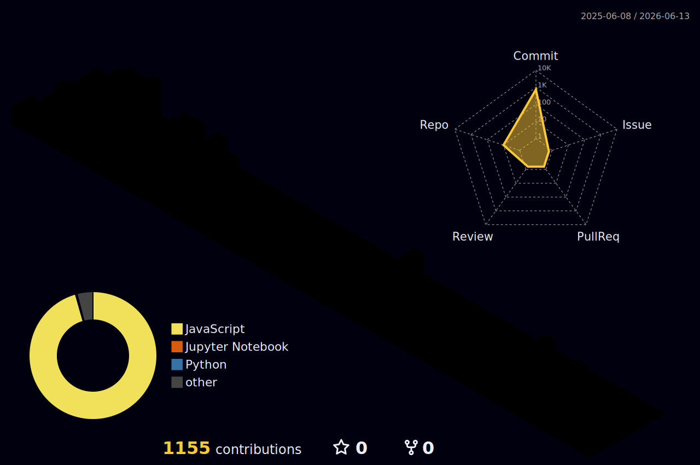

<!-- Banner Image -->

<!-- Typing SVG Animation -->

  

---

## 🧠 About Me

- 🔭 I'm currently working with **MERN Stack**
- 🌱 Exploring **Next.js, Typescript, Supabase, Three.js, GSAP**
- 🌐 Check out my [Portfolio](https://sajal-pakira-portfolio-25.vercel.app/)
- 💬 Ask me about **React, Node, MongoDB, Express, Web Animations**
- 🧩 Fun Fact: I love making things move with **GSAP & Three.js**

---

## 💻 Tech Stack

### 🧠 Languages

  
  
  
  
  

### 🎨 Frontend

  
  
  
  
  
  
  

### 🛢️ Databases

  
  
  
  
  
  
  
  

### ⚙️ Backend & Tools

  
  
  
  
  
  
  
  
  

### 🔧 DevOps & Version Control

  
  
  
  
  
  

### 🛠️ IDEs & Tools

  
  
  

---

### :zap: Most Used Languages ❤️

  
   
  
  

---

### :zap: GitHub Stats 📈

  
    
  

 

### 🎨 3D Contribution Graph

---

## 🔗 Connect With Me

  
  
  
  
  

---

## 🧠 Fun Zone

> "Code is like humor. When you have to explain it, it's bad." – Cory House

  

---

<!-- Visitor Badge -->

  

